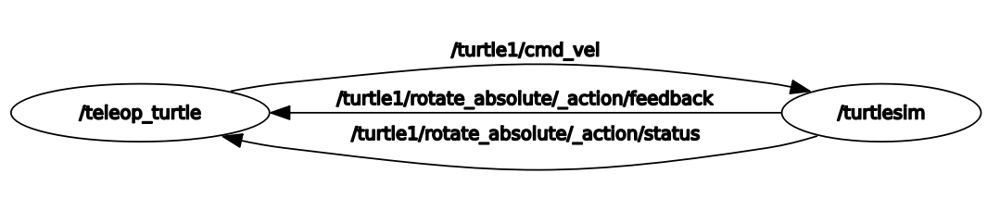

# ПР01. Граф ROS 2 и разрыв связи между доменами

[Версии среды](environment.json) · [ROS Doctor](doctor.txt) ·

## 1. Исправная система

Терминал A: `ROS_DOMAIN_ID=1`, запущен `ros2 run turtlesim turtlesim_node`.
Терминал B: `ROS_DOMAIN_ID=1`, запущен `ros2 run turtlesim turtle_teleop_key`.
Терминал C: `ROS_DOMAIN_ID=1`, запущен `ros2 run rqt_graph rqt_graph`.
Терминал D: `ROS_DOMAIN_ID=1`, команды наблюдения. Все три терминала находятся
в одной среде ROS; контейнер использует отдельную bridge-сеть.

Команда `ros2 node list --no-daemon --spin-time 2` вернула:
1. ROS_DOMAIN_ID = не задана
```text
fadan@FedosDan:~/Study$ echo $ROS_DOMAIN_ID

fadan@FedosDan:~/Study$ 
```
2. ROS_DOMAIN_ID = 1
```text
fadan@FedosDan:~/Study$ echo $ROS_DOMAIN_ID
1
fadan@FedosDan:~/Study$
/rqt_gui_py_node_61658
/teleop_turtle
/turtlesim
fadan@FedosDan:~/Study$
```

| Нода | Роль |
|---|---|
| `/teleop_turtle` | Читает клавиши терминала и публикует команду скорости |
| `/turtlesim` | Принимает скорость, двигает черепаху, публикует позу и цвет под ней |
| `/rqt_gui_py_node_61658` | Рисует граф взаимодействия нод |



### Топики и типы

`ros2 topic list -t` дал следующий список:

```text
/parameter_events [rcl_interfaces/msg/ParameterEvent]
/rosout [rcl_interfaces/msg/Log]
/turtle1/cmd_vel [geometry_msgs/msg/Twist]
/turtle1/color_sensor [turtlesim_msgs/msg/Color]
/turtle1/pose [turtlesim_msgs/msg/Pose]
```


| Топик | Издатель → получатель в этом опыте | Назначение |
|---|---|---|
| `/turtle1/cmd_vel` | `/teleop_turtle` → `/turtlesim` | Линейная и угловая скорость |
| `/turtle1/pose` | `/turtlesim` → временные CLI-подписчики `echo` и `hz` | Положение, угол и скорости |
| `/turtle1/color_sensor` | `/turtlesim` → в опыте не использован | Цвет под черепахой |
| `/parameter_events` | Обе ноды; у `/turtlesim` также есть подписка | События параметров |
| `/rosout` | Обе ноды → отдельного подписчика не запускал | Служебные логи |

[Turtlesim Node Info](turtlesim_node_info.txt) | [Turtlesim Topic Info](turtlesim_topic_info.txt) 

### Схема основных потоков

```text
клавиша ↑
    │
    ▼
/teleop_turtle
    │  /turtle1/cmd_vel [geometry_msgs/msg/Twist]
    ▼
/turtlesim ──► окно: движение и след черепахи
    │  /turtle1/pose [turtlesim_msgs/msg/Pose]
    ├──► ros2 topic echo … --once   (одна поза)
    └──► ros2 topic hz …            (частота сообщений)
```

`ros2 topic type /turtle1/pose` вернула `turtlesim_msgs/msg/Pose`

### Получение позы и движение

До нажатий `ros2 topic echo /turtle1/pose --once` получила:

```yaml
x: 6.328053951263428
y: 6.157889366149902
theta: 0.4256294071674347
linear_velocity: 0.0
angular_velocity: 0.0
```

После одного ↑ и остановки черепахи:

```yaml
x: 8.1641845703125
y: 6.990283966064453
theta: 0.4256294071674347
linear_velocity: 0.0
angular_velocity: 0.0
```

## 2. Частота /turtle1/pose

Команда замера:

```bash
timeout --signal=INT 15s ros2 topic hz /turtle1/pose
```

Замер выполнялся до нажатий, когда черепаха стояла.
Последняя строка измерения:

```text
average rate: 62.499
        min: 0.015s max: 0.018s std dev: 0.00058s window: 812
```

[Полный вывод hz](hz.txt)

## 3. Разрыв домена

Терминал A оставлен работающим в домене 1. В Терминале B остановлен teleop через `Ctrl+C`,
затем выполнены:

```bash
export ROS_DOMAIN_ID=2
ros2 run turtlesim turtle_teleop_key
```

В Терминале C установлен домен 2. `node list --no-daemon --spin-time 2` обнаружил
только `/teleop_turtle`. Симулятор
продолжал работать и оставался виден в своём домене.
Нажатие стрелок не влияло на положение черепахи.

```bash
fadan@FedosDan:~/Study$ ros2 node list --no-daemon --spin-time 2 
/teleop_turtle
fadan@FedosDan:~/Study$ 
```

## 4. Восстановление и сравнение

В Терминале B teleop остановлен и повторно запущен с `ROS_DOMAIN_ID=1`.
В Терминале C также возвращён домен 1.

```bash
export ROS_DOMAIN_ID=2
ros2 run turtlesim turtle_teleop_key
```
 Повторена **та же команда** и все заработало.

### Причина

Домен задаёт область обнаружения ROS-участников. Teleop в домене 2 не
обнаруживает подписчика команд симулятора из домена 1; CLI-подписчик позы
в домене 2 также не обнаруживает издателя. Совпадения имени топика и типа
недостаточно для обмена между этими доменами.